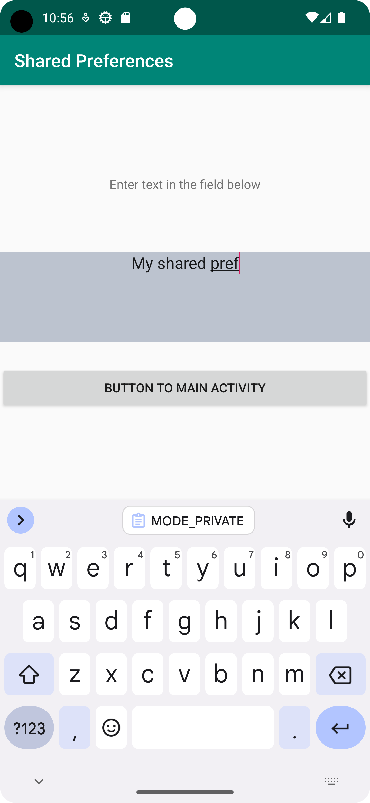
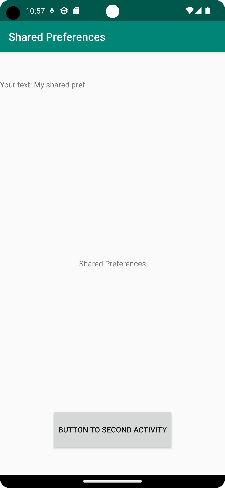

# Rapport

**Shared preferences**

Detta uppgift handlar om att läsa av data i SecondActivity och sedan spara den och visa upp i MainActivity.

SecondActivity klass var skapad samt layout activity_second och activity_main. I layout implementerades rader så som TextView och EditText 
för att ta hand om inmatningar och visa upp dem senare. 

I SecondActivity klass var EditText och buttonToMain definierat.

Sedan var SHARED_PREF_NAME och KEY_TEXT definierat som kommer att vara "nycklar" till SharedPreferences.
```
private static final String SHARED_PREF_NAME = "myPref";
private static final String KEY_TEXT = "myText";
```

När använder har skrivit in text i EditText och tryckt på buttonToMain kommer data att sparas i sharedPreferences och sedan kommer SecondActivity att "avslutas".
```
buttonToMain.setOnClickListener(new View.OnClickListener() {
@Override
public void onClick(View view) {

                SharedPreferences sharedPreferences = getSharedPreferences(SHARED_PREF_NAME, MODE_PRIVATE);
                SharedPreferences.Editor editor = sharedPreferences.edit();
                editor.putString(KEY_TEXT,EditField.getText().toString());
                editor.commit();

                finish();
            }
        });
```
När SecondActivity avslutas kommer MainActivity att köra onResume metod vilken i sin tur kommer att ta data från sharedPreferences 
och visa upp den i TextView SharedText.
```
public void onResume() {
        super.onResume();

        SharedPreferences sharedPreferences = getSharedPreferences(SHARED_PREF_NAME, MODE_PRIVATE);

        SavedText = sharedPreferences.getString(KEY_TEXT,"");

        SharedText.setText("Your text: " + SavedText);
    }
```


Bilder från appen:


